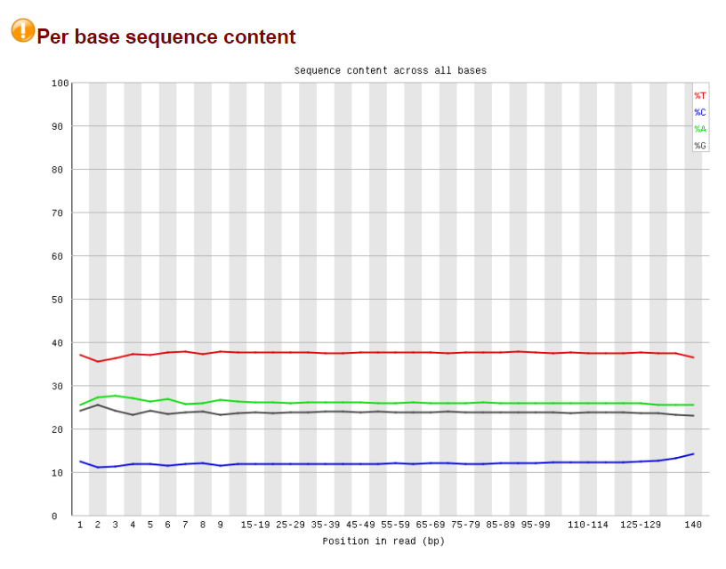
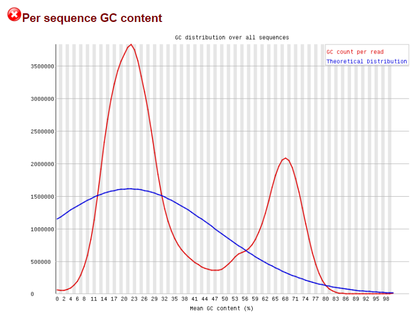
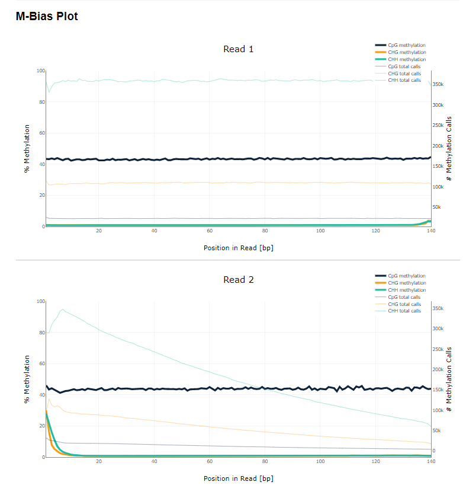
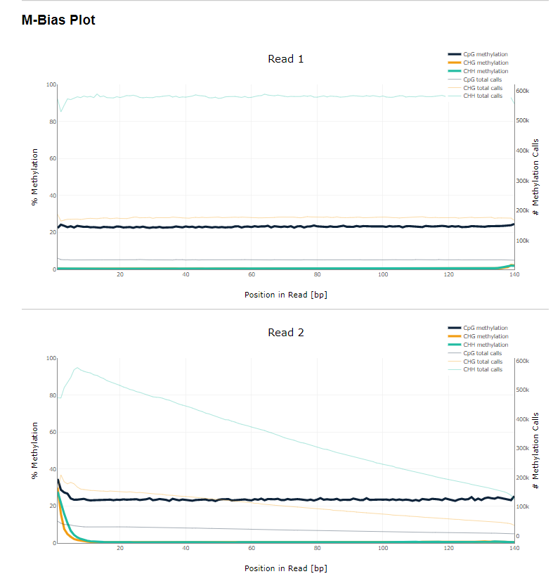
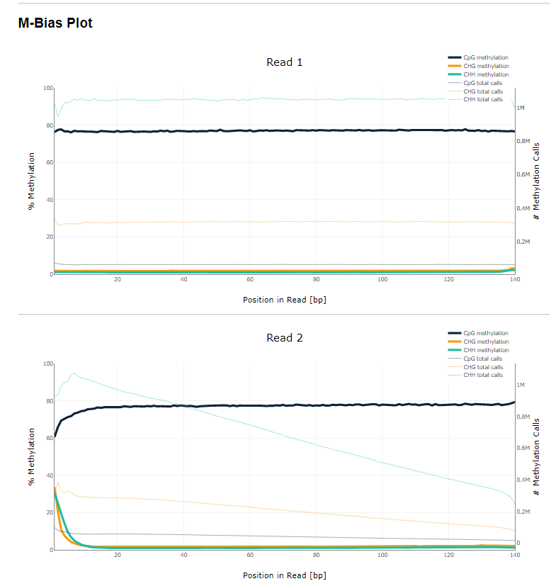
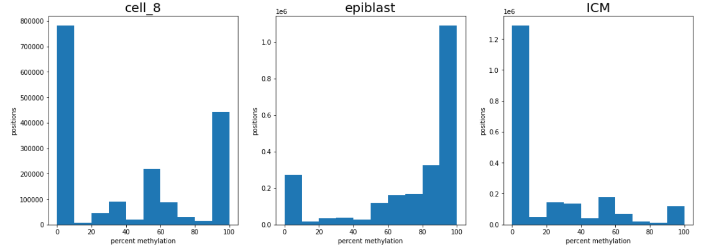
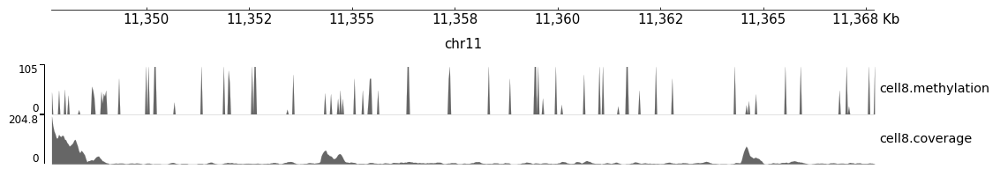
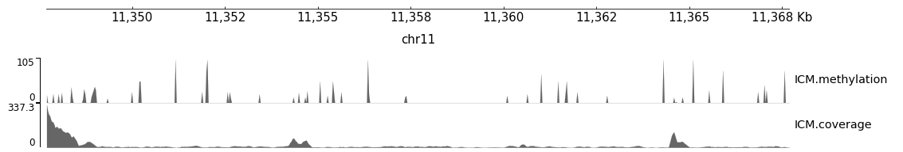
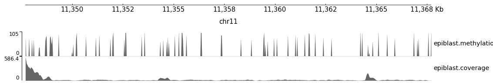

# Домашняя работа по Биоинформатике
Ссылки на Google colab\
Ноутбук с FastQC \
[https://colab.research.google.com/drive/1FLZImetKgOAvY-gRkqWnPaJaj54ggSk9?usp=sharing](https://colab.research.google.com/drive/1FLZImetKgOAvY-gRkqWnPaJaj54ggSk9?usp=sharing) \
Ноутбук с анализом метилирования и всем остальным кодом \
[https://colab.research.google.com/drive/1FLZImetKgOAvY-gRkqWnPaJaj54ggSk9?usp=sharing](https://colab.research.google.com/drive/1ikrVBKQCkpxY27NQu5Q_hNR9y2KUeGfz?usp=sharing)

## Анализ FastQC
Анализ FastQC приведён в файлах SRR5836473_1_fastqc.html и SRR5836473_2_fastqc.html в папке reports.\
Можно заметить, что в полученных ридах из бисульфатного секвенирования очень мало цитозинов (всего 10% от числа всех нуклеотидов) и очень много тиминов (примерно 40% от числа всех нуклеотидов). Это объясняется тем, что при бисульфатном секвенировании неметилированные цитозины превращаются в тимины, за счёт чего общее количество цитозинов в ридах значительно снижается. \

Так же можно заметить, что распределение GC контента в образцах сильно отличается от теоретического, и имеет два характерных пика, возможно это также связано с особенностями бисульфатного секвенирования. Один из пиков (тот что справа) связан с CpG островками, в которых много заметилированных цитозинов (они в процессе секвенирования не превратились в тимин), а другой пик (тот что слева) связан с CpG островками в котором мало метилирования цитозинов (в них соответственно весь неметилированный цитозин превратился в тимин). Так как для метилирования характерно либо почти полное метилирование, либо почти полное отсутствие метилирования, то мы и наблюдаем два пика.

## Количество закартированных ридов
| |cell8|ICM|Epiblast|
|------|-------|-------|------|
|11347700-11367700|1090|1456|2328|
|40185800-40195800|464|630|1062|
## Количество удалённых дубликаций
| cell8 | ICM | Epiblast |
|----|----|----|
|521904|377882|205258|
|18.31%|9.08%|2.82%|

## Отчёты bismark
Прикреплены файлы с отчётами cell8.html, epiblast.html, ICM.html в папке reports.
### M-bias plots
Ниже представлены скриншоты графиков M-bias, сделанных программой bismark. \
На этих графиках можно заметить, во-первых различные уровни метилирования в ридах для разных стадий развития эмбриона, так для 8-клеточного эмбриона средний уровень метилирования равен 43% далее для бластоцисты он понижается до уровня 20% и далее повышается до уровня 77% на стадии эпибласта. \
Также на графиках всех типов для второго рида можно увидеть значительное увеличение процента метилирования CHH и CHG цитозинов, что скорее всего является артефактом секвенирования и потребовало бы очистки.
#### 8-клеточный эмбрион (8cell)

#### Бластоциста (ICM)

#### Эпибласта (epiblast)

## Гистограмма метилирования
Ниже представлены гистограммы метилирования, изображающие распределения различных процентов метилирования нуклеотидов в 8-клеточном эмбрионе (8cell), бластоците (ICM) и эпибласте (epiblast). \

Данные графики похожи с теми, что были представлены к заданию из статьи. \
На 8-клеточном многие позиции в одних ридах были заметилированы, а в других нет. Хотя выделяются на графике пик на 0%, у позиций, которые никогда не метилируются, и 100% у позиций которые всегда заметилированы, хотя на этой стадии количество таких позиций не сильно отличается. \
У бластоцисты распределение смещено в сторону меньшего метилирования, что характеризуется пиком в 0, это говорит опять таки о слабом метилировании генов на этом этапе. \
У эпибласта наоборот распределение смещено в сторону большего метилирования в пике на 100%, что говорит о большом метилировании генов на этом этапе, возможно связанной с отключением генов для развития, которые выполнили свою функцию.

## Уровни метилирования и покрытия
### cell8

### ICM

### epiblast
